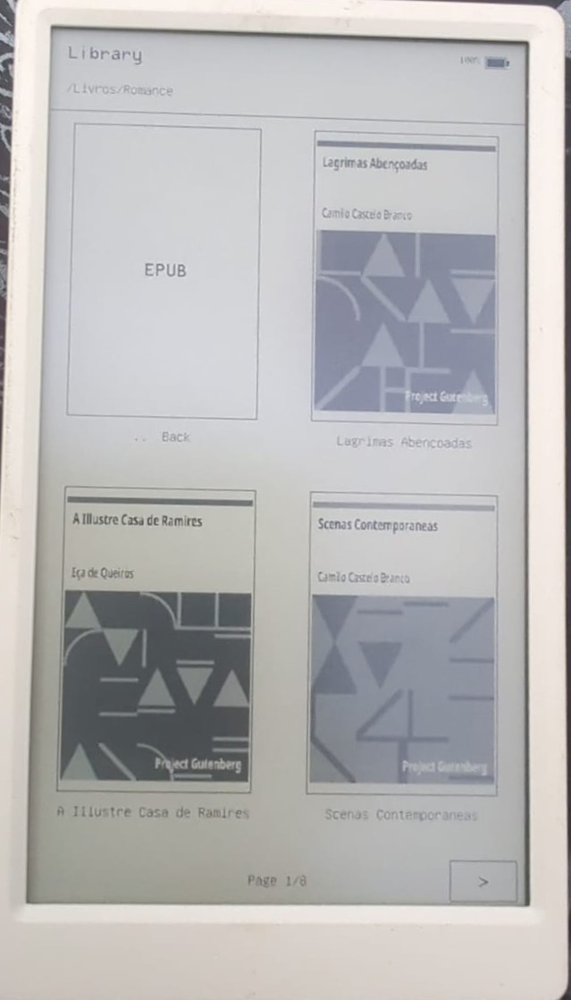
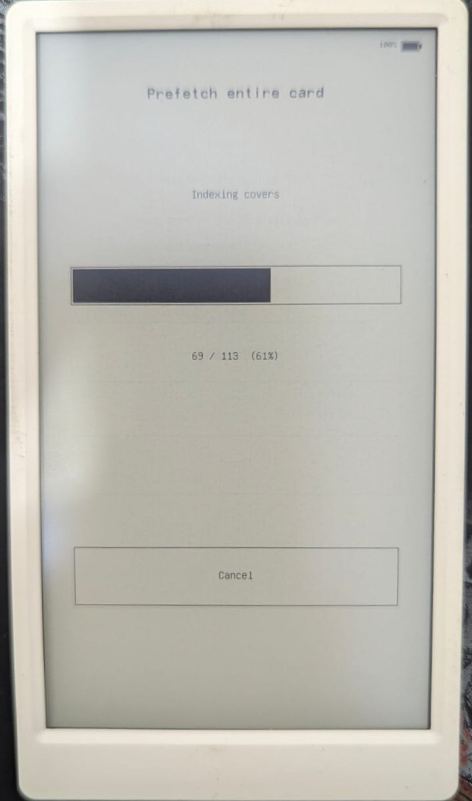

# M5Paper EPUB Reader

Open-source, offline EPUB 2/3 reader firmware for the **original M5Stack
M5Paper**. It reads books directly from a FAT32 microSD card, keeps memory use
bounded, supports touch navigation and physical-button font zoom, and resumes
the last stable reading position.

> This firmware is exclusively for the original ESP32 M5Paper. It does not
> support PaperS3.

## Features

- incremental ZIP/XHTML processing without loading an entire book or chapter;
- EPUB 2 NCX and EPUB 3 navigation-document table of contents;
- continuous pagination, bounded page cache and checkpoint reconstruction;
- font sizes of 16, 24, 32, 36 and 40 px with anchored reflow;
- Book, Sans and Compact font families selectable from the reading menu;
- Kindle-style two-column library with EPUB titles and JPEG/PNG covers;
- high-quality grayscale cover display in the reading menu and sleep screen;
- high-quality inline JPEG/PNG images, proportionally fitted to reading pages
  and prepared by the next-page prefetch when possible;
- persistent reading position, font preference and safe “restart book” action;
- automatic or menu-activated light sleep, touch/lever wake and position resume;
- battery level in the top-right corner, sampled only during screen changes;
- English and Brazilian Portuguese interface, with English as the default;
- deliberate E-Ink refresh modes and serialized display/microSD SPI access;
- adaptive fast/fastest refresh, periodic ghosting cleanup, partial dirty-region
  submission and real front/back page buffers;
- forced full-quality refresh when entering and leaving sleep;
- debounced reading-state writes and bounded automatic SRAM/PSRAM selection;
- optional local web portal for EPUB upload, with Wi-Fi enabled only on demand;
  Bluetooth remains disabled and Wi-Fi returns to off after use or inactivity.

## Install

Requirements: original M5Paper, FAT32 microSD, USB cable, Python 3 and
[PlatformIO Core](https://platformio.org/install/cli).

```powershell
# Clone or download this repository, then enter its directory:
cd M5PaperEpubReader
python -m pip install -r requirements-dev.txt
pio run -e m5stack-paper
pio run -e m5stack-paper --target upload --upload-port COM8
```

Replace `COM8` with the serial port shown by `pio device list`.

Place `.epub` files in `/Books` on the microSD card. If that directory does not
exist, the browser starts at the card root. Open the reading menu by tapping the
top band. The menu includes language selection, table of contents, restart and
library navigation.

## How it works

- **Library:** scans folders cooperatively and shows two books per row. Page
  arrows are available at the bottom, and returning from a subfolder restores
  the previous folder page.
- **Cover preparation:** creates 4-bit thumbnails matching the panel's 16 gray
  levels. Entries are validated by path, file size and modification time, kept
  in a 20-item PSRAM LRU and persisted under `/.m5epub-cache` on the microSD.
- **Prepare library covers:** the library's top menu can scan the entire card
  and prepare missing or changed covers. It is incremental, cancellable and
  periodically displays progress. Normal browsing also prepares missing covers.
- **Reading:** EPUB metadata and XHTML are processed in bounded chunks. The
  current position, page history, font size and family are persisted so a book
  can resume and navigate backward after reopening.
- **E-Ink refresh:** normal and rapid turns use adaptive fast waveforms, ready
  pages use front/back buffers, and periodic full-quality refreshes limit
  ghosting. Entering and leaving sleep always performs a full-quality refresh.
- **Power:** after ten minutes without interaction, or from the reading menu,
  the ESP32 enters light sleep. Touch or either end of the font lever wakes it
  without changing the saved reading position.
- **Web upload:** open the library's top menu and turn on `Upload server`. Choose
  a Wi-Fi network the first time, enter its password on the device, then open
  the displayed IP address or `http://m5paper.local`. The embedded page can
  browse folders, create folders, delete items and upload EPUB files
  sequentially. The radio turns off after eight minutes without a request.

## Screenshots

| Two-column cover library | Whole-card cover preparation |
|---|---|
|  |  |

The interface text in screenshots may differ slightly from the latest build as
labels are refined, while the illustrated library and progress flows remain the
same.

## Supported content

The reader targets textual, reflowable EPUB 2/3 books. DRM, JavaScript, audio,
video, MathML, embedded fonts and fixed-layout EPUB are not supported. Semantic
headings, paragraphs, lists, quotes, bold and italic markers participate in the
text layout. Inline JPEG and PNG images are supported with high-quality E-Ink
refresh. SVG, GIF, WebP, CSS background images and the full CSS cascade are not
currently supported.

## Development

```powershell
python -m pip install -r requirements-dev.txt
pio test -e native
pio run -e m5stack-paper
```

See [CONTRIBUTING.md](CONTRIBUTING.md), [docs/architecture.md](docs/architecture.md)
and [docs/hardware-test-plan.md](docs/hardware-test-plan.md). Planned features
and known bugs are tracked in [docs/roadmap.md](docs/roadmap.md).
Hardware-dependent tests must be performed on the original M5Paper.

## Português

Firmware open source e offline para leitura incremental de EPUB 2/3 no
**M5Stack M5Paper original**. A interface inicia em inglês; no menu de leitura,
toque em `Language: English` para mudar para português. Coloque os livros na
pasta `/Books` do cartão microSD e compile/grave usando os comandos acima.
O tópico “How it works” descreve biblioteca, preparação incremental das capas,
leitura, refresh E-Ink, persistência e funcionamento do modo de espera.
Imagens JPEG e PNG dentro do livro são redimensionadas proporcionalmente e
mostradas com atualização E-Ink de alta qualidade.

Para enviar livros sem retirar o cartão, toque no topo da biblioteca, ative
`Servidor de envio`, escolha a rede e digite a senha. Abra no celular ou
computador o IP mostrado na tela ou `http://m5paper.local`. O Wi-Fi permanece
desligado fora desse modo e é desligado automaticamente após oito minutos sem
requisições.

## License

Copyright © 2026 M5PaperEpubReader contributors. Released under the
[MIT License](LICENSE). Third-party libraries retain their respective licenses;
see [THIRD_PARTY_NOTICES.md](THIRD_PARTY_NOTICES.md).
